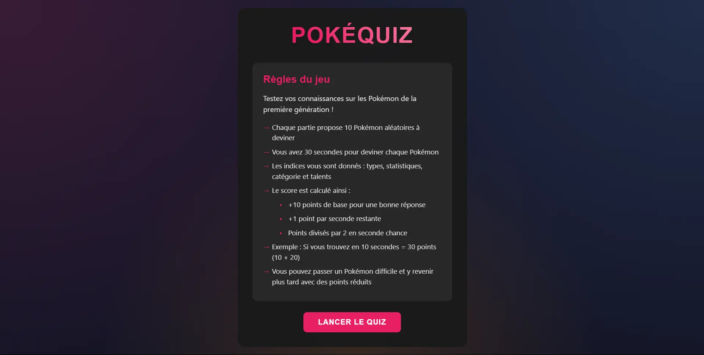

# 🎮 PokéQuiz

Un jeu de quiz interactif sur les Pokémon de la première génération, développé en JavaScript vanilla.



## 📝 Description

PokéQuiz est un jeu de devinettes où les joueurs doivent identifier des Pokémon de la première génération à partir de leur silhouette et d'indices. Le jeu met l'accent sur la connaissance des Pokémon et la rapidité de réponse.

## ✨ Fonctionnalités

- 🎯 10 Pokémon aléatoires à deviner par partie
- ⏱️ 30 secondes pour deviner chaque Pokémon
- 💡 Indices fournis : types, statistiques, catégorie et talents
- 🔄 Possibilité de passer un Pokémon difficile et y revenir plus tard
- 📊 Système de score avec bonus de temps
- 🏆 Classement local des meilleurs scores
- 📱 Interface responsive

## 🎯 Système de points

- +10 points de base pour une bonne réponse
- +1 point par seconde restante
- Points divisés par 2 en seconde chance

## 🛠️ Technologies utilisées

- HTML5
- CSS3 (avec variables CSS et animations)
- JavaScript (Vanilla)
- [Tyradex API](https://tyradex.vercel.app/) pour les données Pokémon
- LocalStorage pour la sauvegarde des scores

## 🚀 Installation

1. Clonez le repository

   ```bash
   git clone https://github.com/Jerome-Dubos/poke-quiz.git
   ```

2. Ouvrez le fichier `index.html` dans votre navigateur
   ```bash
   cd poke-quiz
   open index.html # ou double-cliquez sur le fichier
   ```

## 💻 Utilisation

1. Cliquez sur "Lancer le quiz" pour commencer une partie
2. Observez la silhouette et les indices du Pokémon
3. Entrez votre réponse dans le champ de texte
4. Utilisez le bouton "Passer" si vous ne trouvez pas
5. Terminez les 10 Pokémon pour enregistrer votre score

## 🎨 Personnalisation

Le jeu utilise des variables CSS pour les couleurs principales. Vous pouvez les modifier dans le fichier `style.css` :

```css
:root {
  --primary-color: #e91e63;
  --secondary-color: #666666;
  --accent-color: #4a90e2;
  /* etc. */
}
```

## 🤝 Contribution

Les contributions sont les bienvenues ! N'hésitez pas à :

1. Fork le projet
2. Créer une branche pour votre fonctionnalité
3. Commit vos changements
4. Push sur la branche
5. Ouvrir une Pull Request

## 🙏 Remerciements

- [Tyradex](https://tyradex.vercel.app/) pour l'API Pokémon en français
- [Poppins](https://fonts.google.com/specimen/Poppins) pour la police d'écriture
- La communauté Pokémon pour son soutien continu
